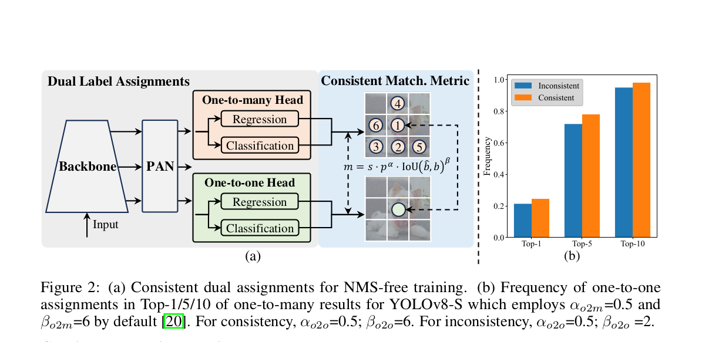
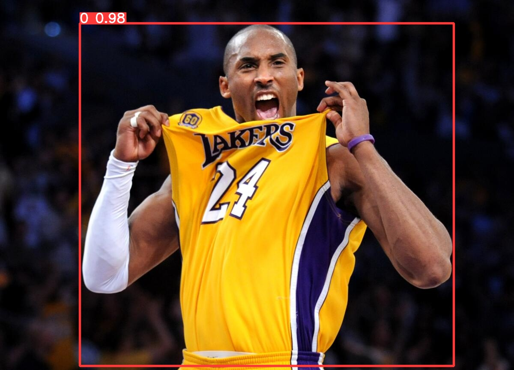

# YOLOv10 : Real Time Detection

### YOLOv10 introduces a new approach to post-processing techniques in object detection methods. It significantly reduces the latency of the model.

# What is Latency ?
##  Latency refers to the time it takes for the model to analyze an image and tell you what objects it found. The faster the response, the lower the latency, and the smoother the experience. It’s typically measured in milliseconds (ms). 

Refer this link for Evaluation paramter invloved in Object detection models [link](https://medium.com/@nikitamalviya/evaluation-of-object-detection-models-flops-fps-latency-params-size-memory-storage-map-8dc9c7763cfe)

# Methodology
##  Consistent Dual Assignments for NMS-free Training

## To combine the strengths of both label assignment strategies,   they introduced a one-to-one matching head to the YOLO model alongside the traditional one-to-many head.   Both heads are optimized during training, but only the one-to-one head is used for inference, eliminating the need for NMS post-processing and maintaining efficient deployment. **This dual approach enhances accuracy and convergence speed.**
refer the [docs](docs/yolov10.pdf) for more details !

# Implementation
## [Ultralytics](https://docs.ultralytics.com/) " Is working to integrate YoloV10 in Ultralytics python package"
### Clone the repo (Official)

        git clone https://github.com/THU-MIG/yolov10.git

### Predicition

        import os
        import requests
        from ultralytics import YOLOv10

        def download_yolov10_weights(model):
        urls = {
                "yolov10n": "https://github.com/jameslahm/yolov10/releases/download/v1.0/yolov10n.pt",
                "yolov10s": "https://github.com/jameslahm/yolov10/releases/download/v1.0/yolov10s.pt",
                "yolov10m": "https://github.com/jameslahm/yolov10/releases/download/v1.0/yolov10m.pt",
                "yolov10b": "https://github.com/jameslahm/yolov10/releases/download/v1.0/yolov10b.pt",
                "yolov10x": "https://github.com/jameslahm/yolov10/releases/download/v1.0/yolov10x.pt",
                "yolov10l": "https://github.com/jameslahm/yolov10/releases/download/v1.0/yolov10l.pt"
        }

        # Check if the model is valid
        if model not in urls:
                print(f"Error: model '{model}' is not valid. Choose from: {list(urls.keys())}")
                return
        
        url = urls[model]
        
        # Create the weights directory if it doesn't exist
        os.makedirs('weights', exist_ok=True)
        
        file_path = os.path.join('weights', f"{model}.pt")

        # Download the file
        response = requests.get(url)
        
        # Check if the request was successful
        if response.status_code == 200:
                # Write the content to the file
                with open(file_path, 'wb') as file:
                file.write(response.content)
                print(f"Downloaded: {file_path}")
        else:
                print(f"Failed to download: {url}")

        #run
        #choose the model
        model = "yolov10s"
        download_yolov10_weights('yolov10s')
        model = YOLOv10(f'weights/{model}.pt')
        results = model(source=f'images/kobe.jpeg', conf=0.25,save = True)
        print(results[0].boxes.xyxy)

### Output
