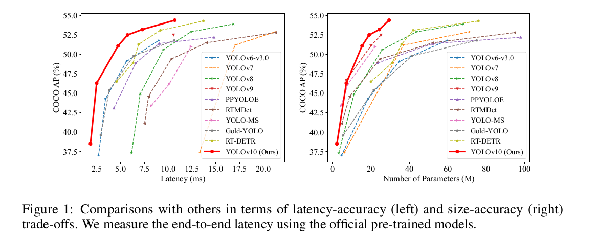

# YOLOv10 : Real Time Detection

### YOLOv10 introduces a new approach to post-processing techniques in object detection methods. It significantly reduces the latency of the model.

# What is Latency ?
##  Latency refers to the time it takes for the model to analyze an image and tell you what objects it found. The faster the response, the lower the latency, and the smoother the experience. It’s typically measured in milliseconds (ms). 

Refer this link for Evaluation paramter invloved in Object detection models [link](https://medium.com/@nikitamalviya/evaluation-of-object-detection-models-flops-fps-latency-params-size-memory-storage-map-8dc9c7763cfe)

